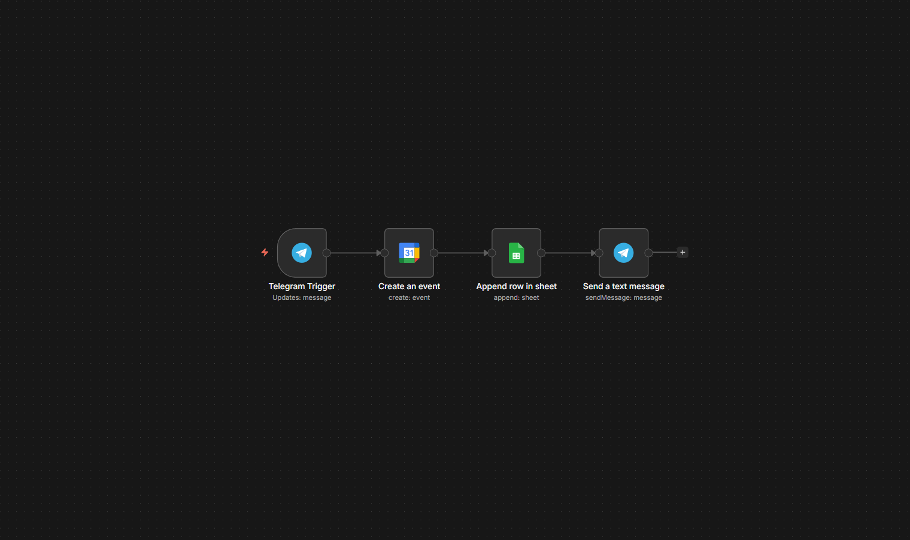

# Telegram-to-Google-Calendar-Sheets-Automation (Open Source)

### 🛠 System Architecture

An open-source n8n workflow template that turns your Telegram bot into a personal assistant. Capture notes, tasks, or events, and automatically sync them to your Google Sheets and Google Calendar.

---

### 🌟 Features
* **Open Source:** Free to use, fork, and modify for your personal or commercial projects.
* **Automated Logging:** Saves all incoming Telegram messages into a Google Sheet.
* **Smart Scheduling:** Automatically creates corresponding events in Google Calendar.
* **Instant Confirmation:** Sends a reply back to Telegram once the task is completed.
* **Cost-Efficient:** Runs completely on free-tier services.

---

### 📦 What's Inside
* **`workflow.json`**: The n8n template file.
* **`instructions.md`**: Step-by-step setup guide.
* **`README.md`**: Overview and documentation.

---

### ⚙️ Requirements
* **n8n** (self-hosted or cloud)
* **Google Account** (with active Google Calendar and Google Sheets API access)
* **Telegram Bot Token** (obtained via `@BotFather`)

---

### 🚀 Quick Setup
1. Clone or download the files from this repository.
2. Open n8n and import the `workflow.json` file.
3. Connect your Telegram, Google Sheets, and Google Calendar credentials.
4. Activate the workflow and test it with your bot.

---
### 📂 More Projects
Discover more awesome AI automation projects and workflows available in our ecosystem:
* **All Projects**: [github.com/nar0ka](https://github.com/nar0ka)
  

### ⚖️ License
This project is licensed under the **MIT License** — feel free to use, modify, and distribute it, including for creating digital products to sell on marketplaces.

### 🔗 Links & Contacts
* **GitHub**: [github.com/nar0ka](https://github.com/nar0ka)
* **Gumroad Store**: [naroka.gumroad.com](https://naroka.gumroad.com)
* **Affiliate & Partnership Program**: [Affiliates](https://naroka.gumroad.com/affiliates)

---

### 🤝 Contributing
Contributions, suggestions, and improvements are welcome! Feel free to create a Pull Request or open an issue if you have ideas for new features.
